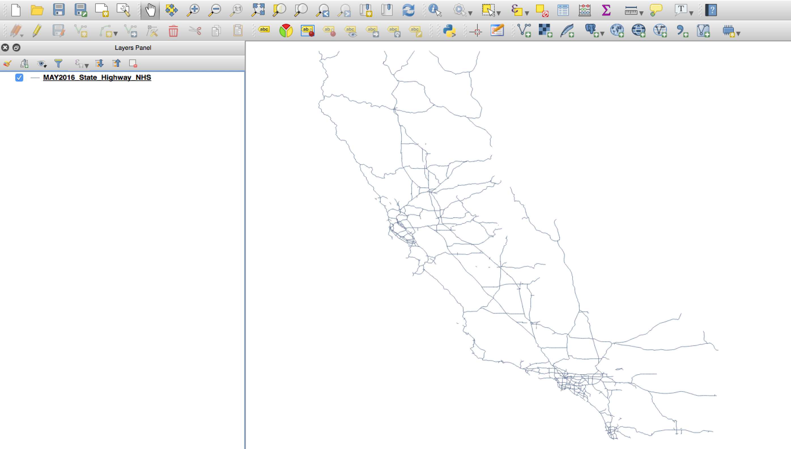

<h1 class="ml7">
  
    
Data&nbsp;&nbsp;Journalism&nbsp;&nbsp;&nbsp;USC&nbsp;&nbsp;2021

  
</h1>

# Week 11
This week, we're diving head first into mapping.

---

### Lecture

[Slides](https://docs.google.com/presentation/d/10THayc_otwZxhaySGf4M8Dxw67RFAMFbfflEzUQNbl8/edit?usp=sharing)

---

### Hands-on

**1. Download these**

[Link to pre-k data](../data/prek_sites.csv) | [Caltrans transpo GIS data](https://gisdata-caltrans.opendata.arcgis.com/datasets/77f2d7ba94e040a78bfbe36feb6279da_0) (we're using the the "SHN lines" data, download the shapefile)

**2. Unzip the highways shapefile and double click to open in QGIS**

Cool, it's every highway in the state! Let's take a second to unpack what we see here.

Then, let's:

* zoom in/out
* click with the info tool to learn more
* change the color, shape and transparency of the lines (double-click on the name in the layers panel)
* open up the attribute table (right click on the name in the layers panel)
* figure out what the CRS is
	* Wait. [What's a CRS?](https://github.com/d3/d3-geo-projection)

**3. Drag the Pre-K sites into the application to open in QGIS**

Wait, that doesn't work.

Let's inspect what we see there. Any clues on where the geographic data might be?

**4. Brining in a spreadsheet into a map**

How do we import it? Go to Layer > Add Layer > Add Delimited Text Layer

**5. Figure out if our school sites are within 500 feet of a state highway**

Let's install MMQGIS.

Plugins > Manage and Install Plugins > [MMQGIS](http://michaelminn.com/linux/mmqgis/)

Now we can create a buffer. Should we create it on the Pre-K sites, or on the highways?

Now go to MMQGIS > Create > Create Buffers

Your maps should look like this when it's done:

Cool. It's all there now. Let's remove the original highway shapefile.

We can — time pending, see how to add a basemap with QuickMapServices here.

**6. How do we figure out which sites are within the 500 foot buffer?**

We need to join the 2 layers.

What's that mean?

Here's how we do it:

It might take a couple minutes (or more) to run. Why?

**7. That looks like all of them?**

Let's open up the attribute table and see what actually happened under the hood.

* How can we select just the ones that really joined?
* How can we export this as a spreadsheet and analyze for our story (we'll go deeper into this, time pending)

---

### Links

* [QGIS tutorials](https://www.qgistutorials.com/en/) — great resource
* [Polluted Preschools: 169 LA childcare centers are too close to freeways](https://www.scpr.org/news/2016/03/29/58878/pollution-near-preschools-is-impacting-nearly-10-0/)

---

### Homework

* **Final Project**: You should be working on drafts of story and graphics, looking for unanswered questions. The rough draft is due on April 16!!!
* Story memo: 50-100 words about Final Project progress over last week