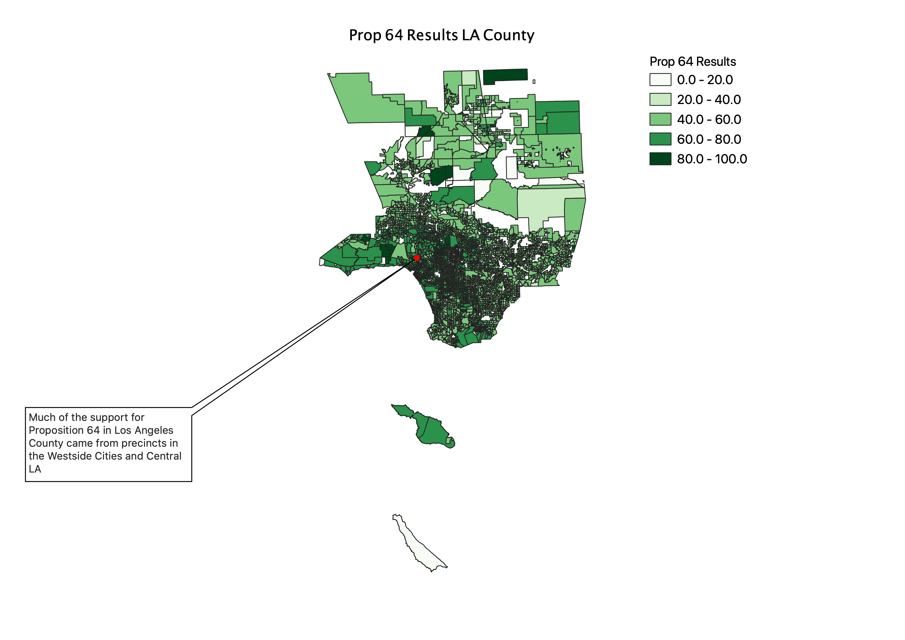

<div class="header">
<h1 class="ml7">
  <span class="text-wrapper">
    <span class="letters"><p id ="usc p">Data&nbsp;&nbsp;Journalism&nbsp;&nbsp;&nbsp;USC&nbsp;&nbsp;2021</p></span>
  </span>
</h1>
</div>
<script src="https://cdnjs.cloudflare.com/ajax/libs/animejs/2.0.2/anime.min.js"></script>

<script src="https://ajax.googleapis.com/ajax/libs/jquery/3.3.1/jquery.min.js"></script>

<style>
.header{
      background-image: linear-gradient(to right, #a8c0ff, #3f2b96);
}

.ml7 {
  position: relative;
  font-weight: 1200;


}
.ml7 .text-wrapper {
  position: relative;
  display: inline-block;
  padding-top: 0.2em;
  padding-right: 0.05em;
  padding-bottom: 0.1em;
  overflow: hidden;
  padding-left: 14px;

}
.ml7 .letter {
  transform-origin: 0 100%;
  display: inline-block;
  line-height: 1.3em;
  font-size: 3.6em;
  color: #FFFFFF
}


</style>


<script>
// Wrap every letter in a span
$('.ml7 .letters').each(function(){
  $(this).html($(this).text().replace(/([^\x00-\x80]|\w)/g, "<span class='letter'>$&</span>"));
});

anime.timeline({loop: true})
  .add({
    targets: '.ml7 .letter',
    translateY: ["1.1em", 0],
    translateX: ["0.55em", 0],
    translateZ: 0,
    rotateZ: [180, 0],
    duration: 1050,
    easing: "easeOutExpo",
    delay: function(el, i) {
      return 50 * i;
    }
  }).add({
    targets: '.ml7',
    opacity: 0,
    duration: 1000,
    easing: "easeOutExpo",
    delay: 1000
  });
</script>


# Week 15
This week, we'll explore the wild world of geocoding.

---

### HW revue

You all put your own twist on this week's homework:




---

### Lecture

[Slides](https://docs.google.com/presentation/d/1gvbL1n2p5AbUQOqmIneBS9Lj3kRBJwn0PWXmygnxzUU/edit?usp=sharing)

---

### Hands-on

**1. Get some data**

Let's grab data on shootings involving L.A. County Sheriff's deputies [here](https://data.lacounty.gov/Criminal/All-Shooting-Incidents-for-Deputy-Involved-Shootin/d5zc-33fr).

Let's open and explore in Excel. You'll notice that this does have lat/lon. That'll come in handy when we want to see how accurate our geocodes are.

**2. Learn about geocoding in QGIS**

There are a couple options [for how to do that](http://duspviz.mit.edu/tutorials/geocoding/).

**3. Check out how the free version of a paid service works**

Point your browser [here](https://www.geocod.io/)

**4. Open file up in QGIS**

I suggest EPSG 4269: NAD 83 as the CRS

**5. Also open up the original file in QGIS**

Do they match?

**6. Let's do some reporting**

And figure out how many of these shootings happen in census tracts with below average incomes.

Start by firing up R. Begin with this:

```
library(tidycensus)
library(tidyverse)
options(tigris_use_cache = TRUE)

la <- get_acs(state = "CA", county = "Los Angeles", geography = "tract", variables = "B19013_001", geometry = TRUE)
```

What'd we do there?

This isn't really necessary, but it's nice to see how simple it is to map it in R.

```
la %>%
  ggplot(aes(fill = estimate)) + 
  geom_sf(color = NA) + 
  coord_sf(crs = 26911) + 
  scale_fill_viridis_c(option = "magma") 
```

**7. Compare to median household income**

Let's get the median household income for the county as a whole.

```
la_median <- get_acs(state = "CA", county = "Los Angeles", geography = "county", variables = "B19013_001", geometry = FALSE)
```


Alright here's the big comparison. Let's use case_when.

```
la$median <- case_when(
    la$estimate >= la_median$estimate ~ "above median", 
    TRUE ~ "below median")
```
And let's check how many tracts are below the median income.

```
la %>% group_by(median) %>% tally()
```

**8. Export that data**

I'm putting mine in my Downloads folder, you'll want to adjust accordingly.

```
install.packages("sf")
library(sf)
st_write(la, "~/Downloads/la.shp")
```

**9. Count points in polygon**

Add the shapefile.

Then, let's try this.


Pretty strightforward. Now, let's open the attribute table and see what it did.

We can highlight the highest counts, by selecting those rows.

**10. Let's figure out if most shootings happen in above or below median income tracts.**

How do we do that? You tell me.

---

### Links

Geocoding services

* [US Census](https://geocoding.geo.census.gov/): Free! But not the most accurate option. US addresses only.
* [Google Maps API](https://developers.google.com/maps/documentation/geocoding/start): Very accurate (but not perfect). 2,500 free geocodes per day. Pay beyond that. API Key required
* [Geocodio](https://www.geocod.io/): API or upload. Fast, relatively cheap, accurate.

Article from lecture

* [Digital maps' unsung hero: how the geocoder puts us on the grid](https://www.theguardian.com/technology/2014/jan/13/google-maps-geocoder)

---

### Homework

* Mapping Assignment 3: I want you to map a dataset related to your Final Project or capstone. Every group member needs to make their own map.
* Story memo: 50-100 words about Final Project progress over last week
