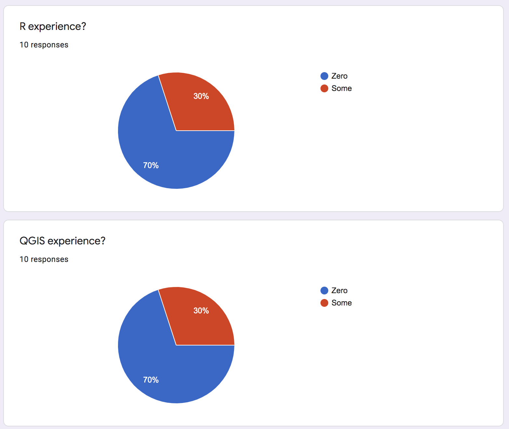

<h1 class="ml7">
  
    
Data&nbsp;&nbsp;Journalism&nbsp;&nbsp;&nbsp;USC&nbsp;&nbsp;2021

  
</h1>

# Week Two
This week, we're going to talk about what makes a great data story, and how you can create one of your own.

---

### Survey responses

---

### Lecture

[Slides](https://docs.google.com/presentation/d/1NoKsLIV9dK4agyiTyc2XGbSux6WzJgpidJ5tLHQH8jc/edit?usp=sharing)

---

### Links

Some stories mentioned:

* [Fatal Force](https://www.washingtonpost.com/graphics/2018/national/police-shootings-2018/?utm_term=.2af26663c5d2)
* [Spies in the skies](https://www.buzzfeednews.com/article/peteraldhous/spies-in-the-skies#.ymOqmNLdjW)
* [Why Kevin Durant’s Shoes Keep Falling Off
](https://fivethirtyeight.com/features/why-kevin-durants-shoes-keep-falling-off/)
* ['A tricky area of philanthropy': LA mayor solicits millions for his favored causes](https://www.scpr.org/news/2017/08/23/74917/la-mayor-garcetti-behested-payments/)
* [Where will the West's next deadly wildfire strike? The risks are everywhere](https://www.azcentral.com/in-depth/news/local/arizona-wildfires/2019/07/22/wildfire-risks-more-than-500-spots-have-greater-hazard-than-paradise/1434502001/)

---

### Homework

* **Important**: Sign up [using this spreadsheet](https://docs.google.com/spreadsheets/d/14IInAih3Vt4fj4e2IH1uIUXeJbnzcM8XhdVx9w-V8oc/edit#gid=0) to do a critique
* **Also important**: Final Project: Every group pitches 3 ideas by Monday @ 5 PM
