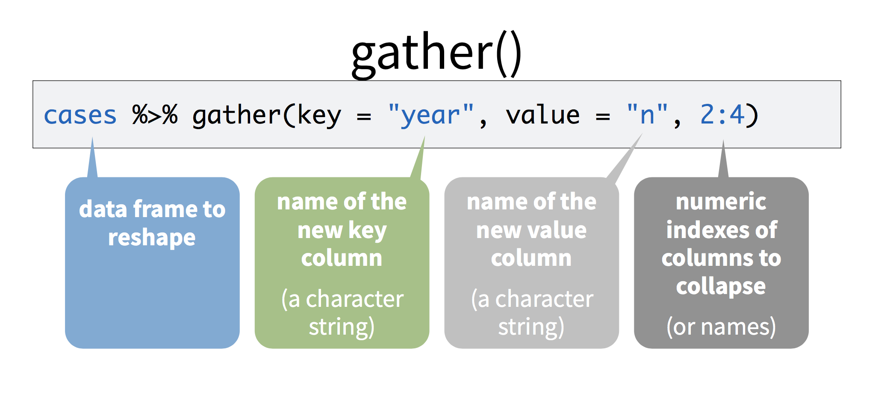

<div class="header">
<h1 class="ml7">
  <span class="text-wrapper">
    <span class="letters"><p id ="usc p">Data&nbsp;&nbsp;Journalism&nbsp;&nbsp;&nbsp;USC&nbsp;&nbsp;2021</p></span>
  </span>
</h1>
</div>
<script src="https://cdnjs.cloudflare.com/ajax/libs/animejs/2.0.2/anime.min.js"></script>

<script src="https://ajax.googleapis.com/ajax/libs/jquery/3.3.1/jquery.min.js"></script>

<style>
.header{
      background-image: linear-gradient(to right, #a8c0ff, #3f2b96);
}

.ml7 {
  position: relative;
  font-weight: 1200;


}
.ml7 .text-wrapper {
  position: relative;
  display: inline-block;
  padding-top: 0.2em;
  padding-right: 0.05em;
  padding-bottom: 0.1em;
  overflow: hidden;
  padding-left: 14px;

}
.ml7 .letter {
  transform-origin: 0 100%;
  display: inline-block;
  line-height: 1.3em;
  font-size: 3.6em;
  color: #FFFFFF
}


</style>


<script>
// Wrap every letter in a span
$('.ml7 .letters').each(function(){
  $(this).html($(this).text().replace(/([^\x00-\x80]|\w)/g, "<span class='letter'>$&</span>"));
});

anime.timeline({loop: true})
  .add({
    targets: '.ml7 .letter',
    translateY: ["1.1em", 0],
    translateX: ["0.55em", 0],
    translateZ: 0,
    rotateZ: [180, 0],
    duration: 1050,
    easing: "easeOutExpo",
    delay: function(el, i) {
      return 50 * i;
    }
  }).add({
    targets: '.ml7',
    opacity: 0,
    duration: 1000,
    easing: "easeOutExpo",
    delay: 1000
  });
</script>

# Week 9

What makes data tidy? Let's find out today.

(If we have time, we'll also bring together the two big halves of our class ... and do some mapping in R.)

### Quick Lecture

[Slides](https://docs.google.com/presentation/d/1JufZLLvOxI5YfEBIfv2RhzhyW9-thI99fljd1qgQxGU/edit?usp=sharing)

---


### Hands-on — Part 1


We're going to be learning about tidy data from the creator of the tidyverse, Hadley Wickham. This tutorial is adapted from his [Data Science in the Tidyverse](https://github.com/hadley/data-science-in-tidyverse/tree/master/slides) workshop.

**1. So what's tidy data?**


It's easy to work with. For example, you can quickly calculate a per capita rate if you already have the population data right there.

Here are the main functions we'll be working with.


Let's load the tidyverse.
```
install.packages("tidyverse")
library(tidyverse)
```


**2. Let's look at some untidy data**

Add a dataset manually.

```
cases <- tribble(
  ~Country, ~"2011", ~"2012", ~"2013",
      "FR",    7000,    6900,    7000,
      "DE",    5800,    6000,    6200,
      "US",   15000,   14000,   13000
)
```
Take a look. What are our variables?

```
head(cases)
```

* Country
* Year
* Count

Take out a piece of paper and draw what it would look like if we rearranged our data so it had three columns: country, year, n

**3. Gather**

Let's parse this

And then run it oursevles.




```
cases %>% gather(key = "year", value = "n", 2:4)
```
Neat! Now we've got something we could chart. Try this.

```
cases %>% gather(key = "year", value = "n", 2:4) %>% ggplot(aes(x= year, y=n, group=Country, color=Country)) + geom_line(lwd=3)
```

**4. Spread**

Let's use some new data.

```
pollution <- tribble(
       ~city,   ~size, ~amount,
  "New York", "large",      23,
  "New York", "small",      14,
    "London", "large",      22,
    "London", "small",      16,
   "Beijing", "large",     121,
   "Beijing", "small",     56
)

head(pollution)
```

The second column is *particle size*. What if we wanted to add together the particle counts for each city?

Right now, we can't.

But ... if 'large' and 'small' were their own columns, then we could. What would our dataset look like if the three columns were city, large, and small.

Draw it out on your piece of paper.

To make that happen, we need `spread`.


```
pollution %>% spread(size, amount)
```

Nice. Now we can create the total particle count for each city.

```
pollution  %>% spread(size, amount) %>% mutate(total = large + small)
```

Or the percent of particles that are large. How would we do that?

If we have any extra time (doubtful), let's do Final Project updates.


---

### Hands-on Part 2 — doing some new things

### Part 2.1: Mapping

**0. Why would you ever use R to do GIS work**

Thoughts?

**1. Get started.**

Fire up R studio. Save a script *in the same folder we used for our Github exercise*.

Once you've got it up, run this.

```
install.packages("leaflet")
install.packages("rgdal")
```

And then this.

```
library(leaflet)
library(rgdal)
```

Let's dive in.

**2. Leaflet in R**

There's an R package that lets you make and export interactive leaflet maps. I've used it at KPCC to create [election maps](http://projects.scpr.org/maps/cd34-map/?=embed/), and maps about [housing](https://www.scpr.org/news/2018/07/31/85109/where-do-people-get-money-to-buy-california-homes/).

It's good. So let's see how it works.

Download the shapefile of states from the U.S. Census [here](https://www.census.gov/cgi-bin/geo/shapefiles/index.php).

Unzip it and put it in the same folder we've been using today.

Now we'll head back to our script and open it up. It should look something like this

```
states <- readOGR("path/to/yourfile/",
  layer = "tl_2019_us_state", GDAL1_integer64_policy = TRUE)
```

Next let's select some states that are cool.

```
bestCoast <- subset(states, states$STUSPS %in% c(
  "CA","OR","WA"
))
```

And now, believe it or not, we can map it.

```
leaflet(bestCoast) %>%
  addPolygons(color = "#444444", weight = 1, smoothFactor = 0.5,
    opacity = 1.0, fillOpacity = 0.5,
    fillColor = ~colorQuantile("YlOrRd", ALAND)(ALAND),
    highlightOptions = highlightOptions(color = "white", weight = 2,
      bringToFront = TRUE))

```

Let's break down every component part of what we just did.

And once we've done that, let's figure out how to add a base layer —  a map below our shapefile that will show us where the shapefiles are relative to the rest of the world.

The code itself is `addTiles()`. How do we add that?

Now check out [other options for basemaps on the R Leaflet official site](https://rstudio.github.io/leaflet/basemaps.html). Add one of those.


---

### Homework


* Map a census dataset.
	* [Go here](https://censusreporter.org) to explore datasets and find their table names.
* Write 100 or so words about what you learned by mapping the data, possible stories you could do based of this analysis.
* I want to see different colors and basemaps on your map.

